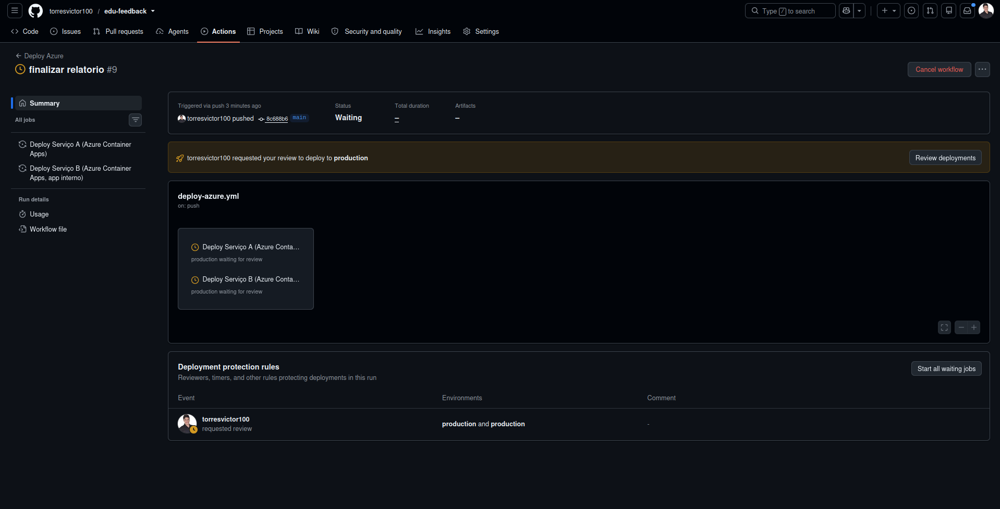
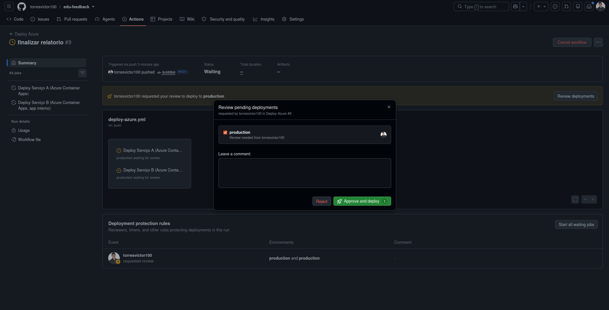

# Relatório do Projeto — EduFeedback

**Tech Challenge — Fase 4 (Cloud Computing, Serverless e Deploy)**
**Repositório:** https://github.com/torresvictor100/edu-feedback
**Data:** 28/07/2026

---

## 1. Descrição do projeto

O EduFeedback é uma plataforma para avaliação de aulas: estudantes enviam feedback (nota de 0 a 10 e descrição) e administradores acompanham a satisfação por meio de relatórios periódicos e recebem notificações automáticas quando um feedback crítico é registrado.

O projeto atende aos requisitos obrigatórios do desafio:

- **Ambiente de nuvem configurado e funcionando**, com configurações de segurança relacionadas aos dados de clientes e com governança de acesso (Microsoft Azure — detalhes e evidências nas seções 2.5 e 3.4).
- **Configuração dos componentes de suporte** (banco de dados etc.) — seção 2.4.
- No mínimo duas funções serverless, cada uma com responsabilidade única (seção 5).
- Deploy automatizado dos componentes atualizáveis (seção 3).
- **Aplicação monitorada** (seção 4.1 e 4.2).
- **Notificações automáticas aos administradores para problemas críticos** (seção 4.2 e 5.1).
- Relatório semanal com média de avaliações (seção 5.2).

A solução foi dividida em **dois serviços independentes**, que compartilham o mesmo banco de dados PostgreSQL:

| Serviço | Responsabilidade | Tecnologia |
|---|---|---|
| **Serviço A** — API principal | Login de administrador (JWT), recebimento de feedback (`POST /avaliação`), consulta de relatórios | Java 21 + Spring Boot 3 |
| **Serviço B** — Componentes serverless | Notificação de feedback crítico e geração agendada de relatório | Java 21 + Quarkus 3 (endpoint interno) + Azure Container Apps Jobs (gatilho) |

---

## 2. Arquitetura da solução

### 2.1 Visão geral do fluxo

```
Estudante (cliente externo, sem autenticação)
  └─▶ POST /avaliação  ──▶  Serviço A (Spring Boot)
                               ├─▶ PostgreSQL (tabela avaliacoes)
                               └─▶ nota ≤ 3 → publica na fila "notificacoes-criticas"
                                              (Azure Storage Queue)

Administrador (cliente externo)
  ├─▶ POST /auth/login          ──▶ Serviço A ──▶ JWT
  └─▶ GET /relatorios[/{id}]    ──▶ Serviço A ──▶ PostgreSQL (JWT obrigatório)

Serviço B — Container App interno (Quarkus, sem ingress externo)
  + 2 Container Apps Jobs (gatilho fino, serverless)

  Job "job-relat-*"  (Schedule, cron semanal, seg. 08h UTC)
     └─▶ POST /internal/relatorio-agendado (X-Internal-Secret)
            └─▶ GerarRelatorioAgendadoUseCase ──▶ PostgreSQL (lê avaliações, grava relatório)

  Job "job-crit-*"   (Event, escalado por KEDA sobre a fila "notificacoes-criticas")
     └─▶ consome 1 mensagem da fila
     └─▶ POST /internal/feedback-critico (X-Internal-Secret)
            └─▶ NotificarFeedbackCriticoUseCase ──▶ lê e-mails dos admins (PostgreSQL)
                                                  ──▶ envia e-mail via Azure Communication Services
```

### 2.2 Modelo de nuvem escolhido

**Azure Container Apps** para tudo — API pública (Serviço A), endpoint interno (Serviço B) e os dois componentes serverless (Container Apps Jobs). Essa escolha unificou toda a solução numa única plataforma gerenciada, sem Kubernetes para administrar.

**Por que Container Apps, e não App Service ou uma VM:** o principal motivo foi custo viável para um projeto de estudo. O Container Apps permite configurar `minReplicas: 0` — ou seja, o container **fica desligado (custo zero de computação) quando não há requisição chegando**, e só sobe automaticamente quando alguém acessa a aplicação (scale-from-zero). Isso evita pagar por um servidor ligado 24/7 só pra atender um volume de uso baixo, típico de um projeto acadêmico, sem abrir mão de a aplicação continuar disponível sob demanda.

Essa mesma lógica de custo se aplica a cada componente, mas com um comportamento de escala ligeiramente diferente por papel:

- **Serviço A** — Container App público, com ingress externo, `minReplicas: 0` a 3 réplicas. Fica "dormindo" sem custo quando ninguém envia avaliação ou faz login, e escala automaticamente (com um pequeno cold start) na primeira requisição.
- **Serviço B (endpoint interno)** — Container App **sem ingress externo**, também com `minReplicas: 0`. Não fica exposto à internet — só é alcançável de dentro do Container Apps Environment, ou seja, só os 2 Jobs abaixo conseguem chamá-lo — e só "acorda" quando um dos Jobs o aciona.
- **Serviço B (gatilhos)** — 2 **Container Apps Jobs**, cobrados por execução, `minExecutions: 0` (nada fica rodando entre disparos). Esse é o componente serverless propriamente dito exigido pelo desafio: o Job só existe pelo tempo da execução (segundos), depois é desalocado por completo — o modelo de cobrança mais barato possível para uma tarefa que roda uma vez por semana ou só quando chega um feedback crítico.

**Por que a solução foi dividida em dois serviços (e não uma aplicação única):** essa separação não foi só uma escolha de organização de código — ela existe **para atender a uma exigência obrigatória da atividade**: o enunciado exige, no mínimo, dois componentes serverless com responsabilidade única, além de deixar clara a separação entre serviços como parte da avaliação. Colocar tudo dentro do Serviço A quebraria essa regra (a API principal roda sempre ativa, não é serverless) e misturaria responsabilidades (login/feedback junto com notificação/relatório). Por isso o Serviço B existe como unidade separada, hospedado nos Jobs serverless — cada um dos 2 Jobs cobre exatamente uma das duas automações que o enunciado pede ("o envio de notificações e a geração de relatórios"), com fronteira clara de responsabilidade entre os dois serviços e entre os dois componentes dentro do Serviço B.

O projeto passou por três desenhos até chegar aqui: começou com Azure Functions puro, depois um híbrido Quarkus + Azure Functions Java Worker, e por fim migrou os gatilhos de Azure Functions para Container Apps Jobs — eliminando a necessidade de uma segunda plataforma de deploy só para hospedar os gatilhos, mantendo o requisito de serverless (execuções sob demanda, sem servidor dedicado) e reforçando o mesmo racional de custo: um único Container Apps Environment hospeda tudo, em vez de manter Function App e Container Apps como duas faturas/plataformas separadas.

### 2.3 Componentes provisionados (Infraestrutura como Código)

Todo o ambiente é provisionado via `infra/azure/main.bicep` (Bicep), em um único resource group:

| Recurso | Nome | Papel |
|---|---|---|
| PostgreSQL Flexible Server | `psql-edufeedback01-dev` | Banco compartilhado pelos dois serviços |
| Storage Account + fila | `stedufeedback01dev` | Fila `notificacoes-criticas` |
| Azure Container Registry | `acredufeedback01dev` | Imagens Docker dos dois serviços |
| Container Apps Environment | `cae-edufeedback01-dev` | Ambiente único compartilhado por todos os Container Apps/Jobs |
| Container App (Serviço A) | `app-edufeedback01-dev` | API pública, ingress externo |
| Container App (Serviço B) | `app-func-edufeedback01-dev` | Endpoints internos Quarkus, sem ingress externo |
| Container Apps Job (Schedule) | `job-relat-edufeedback01-dev` | Gatilho semanal do relatório |
| Container Apps Job (Event/KEDA) | `job-crit-edufeedback01-dev` | Gatilho por fila da notificação crítica |
| Application Insights + Log Analytics | `appi-`/`log-edufeedback01-dev` | Observabilidade dos dois serviços |
| Key Vault | `kv-edufeedback01-dev` | 4 segredos (senha do Postgres, JWT, segredo interno, connection string) |
| Azure Communication Services | `acs-edufeedback01-dev` | Envio de e-mail |
| Action Group + 2 Metric Alerts | `ag-`/`alert-excecoes-`/`alert-postgres-cpu-edufeedback01-dev` | Notificação por e-mail em exceções e CPU alta |

### 2.4 Configuração dos componentes de suporte

Além dos Container Apps/Jobs (seção 2.2), a solução depende de componentes de suporte gerenciados pela Azure — banco de dados, fila, registro de imagens, cofre de segredos e envio de e-mail. Todos provisionados via `infra/azure/main.bicep`, com configuração explícita (não é só "criar com o padrão"):

| Componente | Configuração aplicada |
|---|---|
| **PostgreSQL Flexible Server** (`psql-edufeedback01-dev`) | Versão 16, SKU `Standard_B1ms` (Burstable), 32 GB de armazenamento, **backup automático com retenção de 7 dias**, banco `edufeedback`, firewall restrito à regra `AllowAzureServices` |
| **Storage Account** (`stedufeedback01dev`) | `StorageV2`, SKU `Standard_LRS`, `minimumTlsVersion: TLS1_2`, `allowBlobPublicAccess: false`, fila `notificacoes-criticas` provisionada dentro dela |
| **Azure Container Registry** (`acredufeedback01dev`) | SKU `Basic`, `adminUserEnabled: false` — só é possível fazer push/pull via identidade gerenciada com role `AcrPull`, nunca por usuário/senha de admin |
| **Key Vault** (`kv-edufeedback01-dev`) | `enableRbacAuthorization: true` (acesso só via role RBAC, não por access policy antiga), guarda os 4 segredos usados pelos dois serviços |
| **Azure Communication Services** (`acs-edufeedback01-dev`) | `dataLocation: Brazil`, usado só para o envio do e-mail de notificação crítica |
| **Application Insights + Log Analytics** (`appi-`/`log-edufeedback01-dev`) | Retenção de 30 dias, workspace único compartilhado pelos dois serviços |

**Evidência de que estão configurados e em uso real:** o Serviço A e o Serviço B conectam no PostgreSQL na inicialização (sem isso o health check falharia) e as migrations Flyway já rodaram no schema `edufeedback`; a fila `notificacoes-criticas` recebeu mensagem real ao enviar uma avaliação crítica via Postman; o ACR tem as imagens publicadas pelo pipeline de deploy; o Key Vault tem os 4 segredos criados e as roles `Key Vault Secrets User` concedidas às identidades gerenciadas (sem isso os Container Apps/Jobs falham ao subir — ver seção 3.3).

### 2.5 Segurança e governança de acesso

**Governança de acesso (identidade e permissões):**

- **Identidade gerenciada (User-Assigned)** própria para os Container Apps (`id-apps-edufeedback01-dev`) e para os Jobs (`id-jobs-edufeedback01-dev`) — nenhuma credencial de longa duração fica no template ou nas variáveis de ambiente.
- **RBAC de menor privilégio**, concedido explicitamente no Bicep — nenhuma identidade tem mais acesso do que precisa:
  - Container Apps → `AcrPull` (puxar imagem) + `Key Vault Secrets User` (ler segredos).
  - Jobs → só `Key Vault Secrets User`.
- **Deploy sem credenciais estáticas**: o pipeline usa federação **OIDC** entre GitHub Actions e Azure (App Registration + Federated Credential), sem client secret salvo em lugar nenhum — só quem tem acesso ao repositório/environment `production` do GitHub consegue disparar um deploy.
- RBAC do próprio Azure restringe quem, na assinatura, pode alterar recursos do resource group `rg-edu-feedback`.

**Segurança dos dados de clientes (estudantes e administradores):**

- **Segredos nunca em texto puro**: `postgres-admin-password`, `jwt-secret`, `internal-trigger-secret` e `storage-connection-string` ficam no **Azure Key Vault** (`kv-edufeedback01-dev`) e são referenciados nativamente pelos Container Apps/Jobs (`keyVaultUrl` + identidade gerenciada) — nunca copiados como variável de ambiente em texto puro.
- **Autenticação da API**: JWT stateless (HS256) só no Serviço A — `POST /avaliação` (dado do estudante: nota e descrição) é público por contrato do desafio, mas login e consulta de relatório (dados agregados dos alunos) exigem token de administrador válido.
- **Senha de administrador com hash BCrypt** — nunca armazenada em texto plano no banco.
- **Comunicação interna protegida**: os endpoints `/internal/*` do Serviço B (que leem e-mail dos administradores e avaliações para gerar relatório) são validados por um segredo compartilhado (`X-Internal-Secret`, verificado por `InternalSecretValidator`) — sem ele, `401`. Como o Container App que os hospeda **não tem ingress externo**, eles nem são alcançáveis pela internet, só de dentro do Container Apps Environment.
- **Tráfego criptografado**: ingress do Serviço A força HTTPS; Storage Account com `minimumTlsVersion: TLS1_2` e `allowBlobPublicAccess: false` (a fila com os dados da avaliação crítica nunca é acessível publicamente).
- **Firewall do PostgreSQL** restrito à regra `AllowAzureServices` — o banco com os dados de avaliações, relatórios e administradores não fica aberto à internet.
- **Backup automático** do PostgreSQL Flexible Server habilitado (retenção de 7 dias).
- Nenhum dado sensível (nota, descrição do feedback, credenciais) é escrito em log.
- Containers rodam com **usuário não-root**, build multistage (`backend/Dockerfile`, `functions/Dockerfile`) — reduz superfície de ataque da imagem que processa os dados.

---

## 3. Instruções de deploy

### 3.1 Provisionamento inicial da infraestrutura (manual, uma vez)

```bash
az login
az account set --subscription "<subscription-id>"

az group create --name rg-edu-feedback --location brazilsouth

cp infra/azure/main.parameters.example.json infra/azure/main.parameters.json
# preencher postgresAdminPassword, jwtSecret, internalTriggerSecret e
# alertNotificationEmail com valores reais (nunca commitar este arquivo)

az deployment group validate \
  --resource-group rg-edu-feedback \
  --template-file infra/azure/main.bicep \
  --parameters @infra/azure/main.parameters.json

az deployment group create \
  --resource-group rg-edu-feedback \
  --template-file infra/azure/main.bicep \
  --parameters @infra/azure/main.parameters.json
```

Isso cria todos os recursos listados na seção 2.3. Ao final, é preciso confirmar o e-mail de ativação do Action Group (enviado para `alertNotificationEmail`) — sem essa confirmação os alertas não notificam ninguém.

### 3.2 Deploy contínuo do código (automatizado, `.github/workflows/deploy-azure.yml`)

**Gatilho do pipeline:** `push` na branch `main` (deploy automático a cada merge) ou disparo manual via `workflow_dispatch` (aba Actions → "Run workflow"), conforme declarado no topo do workflow:

```yaml
on:
  workflow_dispatch:
  push:
    branches: [main]

permissions:
  id-token: write   # necessário para o login OIDC, sem client secret
  contents: read
```

**O deploy é dividido em 2 jobs independentes, um por container**, cada um construindo e publicando só a sua própria imagem:

| Job | Serviço | O que faz |
|---|---|---|
| `deploy-backend` | Serviço A (API pública) | `./mvnw package` → `az acr build` (imagem `edu-feedback-backend:<sha do commit>`) → `az containerapp update` no Container App `app-edufeedback01-dev` |
| `deploy-functions` | Serviço B (endpoint interno) | `az acr build` a partir de `functions/Dockerfile` (imagem `edu-feedback-functions:<sha do commit>`) → `az containerapp update` no Container App `app-func-edufeedback01-dev` |

Cada job faz login na Azure separadamente via **OIDC** (`azure/login@v2` com `client-id`/`tenant-id`/`subscription-id`, sem senha nem client secret) e usa a tag da imagem = SHA do commit, garantindo rastreabilidade de qual código está publicado em cada Container App. Os 2 Container Apps Jobs (gatilhos serverless) **não** fazem parte deste pipeline — usam a imagem pública `mcr.microsoft.com/azure-cli`, definida direto no Bicep.

**Configuração no GitHub (Settings → Secrets and variables → Actions, dentro do Environment `production`):**

| Secret | Uso |
|---|---|
| `AZURE_CLIENT_ID` | Identidade da App Registration federada via OIDC |
| `AZURE_TENANT_ID` | Tenant da assinatura Azure |
| `AZURE_SUBSCRIPTION_ID` | Assinatura onde os recursos foram provisionados |
| `AZURE_ACR_NAME` | Nome do Container Registry (`acredufeedback01dev`) |
| `AZURE_RESOURCE_GROUP` | `rg-edu-feedback` |

**Segurança do deploy — aprovação manual do administrador:** os dois jobs declaram `environment: production`. Em **Settings → Environments → production → Deployment protection rules**, foi habilitado **"Required reviewers"**, com o administrador do repositório cadastrado como aprovador obrigatório. Na prática, isso significa que **nenhum deploy chega na Azure sem uma aprovação manual explícita**: mesmo que o push em `main` dispare o workflow automaticamente, a execução fica pausada em "Waiting for review" até o administrador entrar na aba Actions e clicar em "Approve and deploy" — evitando que qualquer merge acidental (ou um PR malicioso, num cenário com múltiplos colaboradores) publique código em produção sem revisão humana.

**Evidência — os dois jobs de deploy parados aguardando aprovação**, cada um marcado como "production waiting for review":



**Evidência — tela de aprovação, com o administrador prestes a revisar e liberar o deploy** ("Review pending deployments", com as opções "Reject" ou "Approve and deploy"):



### 3.3 Verificação pós-deploy

- `GET https://<containerAppFqdn>/actuator/health` → `{"status":"UP"}`.
- Testar os endpoints internos disparando manualmente um Job: `az containerapp job start --name job-relat-edufeedback01-dev --resource-group rg-edu-feedback`.
- Conferir "Execution history" dos 2 Jobs no portal (Container Apps → Jobs).
- Rodar a coleção Postman (`postman/edu-feedback.postman_collection.json`) contra a URL pública real.
- Enviar uma avaliação crítica (nota ≤ 3) e confirmar: mensagem na fila → Job `job-crit-*` disparado → e-mail recebido.

### 3.4 Evidência de que o ambiente está configurado e funcionando de verdade

Não é só infraestrutura como código pronta e nunca aplicada — o ambiente foi provisionado na assinatura Azure real (resource group `rg-edu-feedback`) e validado em produção (ambiente `dev`):

- Todos os recursos da seção 2.3 provisionados e respondendo no resource group `rg-edu-feedback`.
- Coleção Postman executada contra a URL pública real do Serviço A: **health check, login, envio de avaliação normal, envio de avaliação crítica e listagem de relatórios — todos retornando 200/201**.
- Job `job-relat-edufeedback01-dev` disparado manualmente (`az containerapp job start`) — a execução chamou o endpoint interno, gerou e persistiu um relatório real, confirmado em seguida via `GET /relatorios`, comprovando a cadeia completa Job → Container App interno → banco de dados.
- Avaliação crítica (nota ≤ 3) aceita pela API em produção (`201`, campo `urgencia: CRITICA`), confirmando que o fluxo de enfileiramento está ativo.
- Os alertas de monitoramento (seção 4.2) aparecem como **Habilitados** no portal, com o Action Group de e-mail confirmado.

Ou seja: o ambiente de nuvem não está apenas "configurado" no papel — está provisionado e funcionando na Azure real, o que pode ser demonstrado ao vivo no vídeo de entrega repetindo qualquer um dos passos acima.

### 3.5 Rollback

- Serviço A / Serviço B (Container Apps): `az containerapp revision list` + `az containerapp update --image <imagem-anterior>`.
- Jobs: não versionam imagem própria (usam `mcr.microsoft.com/azure-cli`); qualquer rollback de comportamento é feito revertendo `infra/azure/main.bicep`.
- Banco de dados: migrations Flyway são incrementais, sem rollback automático.

---

## 4. Configuração do monitoramento

### 4.1 Observabilidade

- **Application Insights** (`appi-edufeedback01-dev`), com **Log Analytics Workspace** (`log-edufeedback01-dev`) como back-end, conectado aos dois Container Apps via `APPLICATIONINSIGHTS_CONNECTION_STRING`.
- Serviço A expõe **Actuator** (`/actuator/health`, `/actuator/metrics`), usado como health check do Container App.
- Serviço B expõe **SmallRye Health** (`/health`) no Container App interno; os 2 Jobs são observados pelos logs estruturados (stdout/stderr) e pelo histórico de execuções em Container Apps Jobs.
- No portal: **Monitor → Métricas/Logs**, ou dentro de cada recurso (App/Job/Postgres), aba **Monitoring**.

### 4.2 Alertas configurados (Azure Monitor)

Provisionados como código em `infra/azure/main.bicep`, com um **Action Group** de e-mail acionando alertas de métrica. Confirmado no portal (Monitor → Alerts → Regras de alerta) que todas as regras estão **Habilitadas** e ativas:

| Alerta | Condição | Severidade | Recurso monitorado | Tipo de recurso | Status |
|---|---|---|---|---|---|
| `alert-excecoes-edufeedback01-dev` | `exceptions/count > 0` — qualquer exceção reportada no Application Insights | 2 — Aviso | `appi-edufeedback01-dev` | Application Insights | 🟢 Habilitado |
| `alert-postgres-cpu-edufeedback01-dev` | `cpu_percent > 80` — CPU do PostgreSQL acima de 80% | 3 — Informativo | `psql-edufeedback01-dev` | Banco de Dados do Azure para servidor flexível | 🟢 Habilitado |

Ambos disparam o mesmo **Action Group** de e-mail, que envia a notificação para o administrador cadastrado (`alertNotificationEmail`).

Adicionalmente, durante a validação manual do monitoramento, foi criado pelo portal um alerta extra de teste sobre o Container App do Serviço A (CPU acima de um limite baixo, ex. 10%), usado para demonstrar de ponta a ponta o recebimento real da notificação por e-mail no vídeo de entrega.

### 4.3 Por que só esses alertas

O EduFeedback é uma aplicação de porte pequeno, sem tráfego alto nem múltiplos serviços em cadeia — não faz sentido instrumentar dezenas de métricas/dashboards que ninguém vai olhar de verdade. A escolha foi cobrir só os dois cenários de falha que realmente importam para o negócio, com um alerta cada:

1. **Qualquer exceção não tratada** (`alert-excecoes-*`) — cobre, de uma vez, erros da API (Serviço A) **e** falha de execução dos Jobs/endpoint interno (Serviço B), já que ambos reportam no mesmo Application Insights. Um único alerta, um único sinal (`exceptions/count > 0`), sem precisar de um alerta por endpoint ou por serviço.
2. **CPU do PostgreSQL acima de 80%** (`alert-postgres-cpu-*`) — o banco é o único ponto compartilhado entre os dois serviços; se ele degradar, os dois param. É o indicador mais direto de sobrecarga do componente mais crítico da solução.

Alertas de latência, taxa de erro HTTP por rota, uso de memória, disco, etc. foram propositalmente deixados de fora nesta primeira versão: aumentariam a complexidade operacional (mais regras pra manter, mais e-mail pra ignorar) sem agregar sinal útil no volume de uso atual. Se o projeto crescer (mais tráfego, mais serviços dependentes entre si), esse é o primeiro lugar a expandir — mas para o escopo de hoje, dois alertas bem escolhidos cobrem exatamente o que o enunciado pede ("aplicação monitorada" + "notificação automática para problemas críticos") sem monitoramento de fachada.

---

## 5. Documentação das funções criadas

O Serviço B implementa **exatamente 2 componentes serverless**, mapeados 1:1 nas duas automações que o enunciado pede ("o envio de notificações e a geração de relatórios"), cada um respeitando a regra de **Responsabilidade Única** exigida pela atividade: um único gatilho, uma única tarefa, nada mais. Cada função combina duas peças:

- um **gatilho fino** (Azure Container Apps Job, `Schedule` ou `Event`, sem nenhuma lógica de negócio, definido só como script em `infra/azure/main.bicep`) — só sabe disparar na hora certa e repassar a chamada via HTTP;
- um **endpoint interno Quarkus** (`/internal/*`, nunca exposto à internet, protegido por um segredo compartilhado `X-Internal-Secret`) — concentra toda a regra de negócio de verdade (CDI, Panache).

### 5.1 Função 1 — Notificação de feedback crítico

| Campo | Valor |
|---|---|
| Gatilho | Container Apps Job `job-crit-edufeedback01-dev` — **Event trigger**, escalado por regra KEDA `azure-queue` sobre a profundidade da fila `notificacoes-criticas` |
| Responsabilidade única | Consumir 1 mensagem da fila e notificar os administradores por e-mail — não calcula nada, não persiste avaliação |
| Endpoint interno | `POST /internal/feedback-critico` — classe [`FeedbackCriticoResource`](functions/src/main/java/br/com/edufeedback/functions/notificacao/infrastructure/web/FeedbackCriticoResource.java) |
| Autenticação | Header `X-Internal-Secret`, validado por `InternalSecretValidator`; sem ele → `401` |
| Lógica de negócio | [`NotificarFeedbackCriticoUseCase`](functions/src/main/java/br/com/edufeedback/functions/notificacao/application/NotificarFeedbackCriticoUseCase.java) — busca e-mails dos administradores (`AdminRepository`, Panache) e envia via `AzureEmailSender` (Azure Communication Services) |

**Fluxo de execução passo a passo:**

1. Serviço A recebe `POST /avaliação` com nota ≤ 3 → publica a mensagem na fila `notificacoes-criticas`.
2. KEDA detecta profundidade ≥ 1 na fila → dispara o Job `job-crit-edufeedback01-dev`.
3. O container do Job (imagem `mcr.microsoft.com/azure-cli`) roda `az storage message get`, lê 1 mensagem.
4. `curl -X POST /internal/feedback-critico` com o corpo da mensagem e o header `X-Internal-Secret`.
5. `FeedbackCriticoResource` valida o segredo, delega para `NotificarFeedbackCriticoUseCase`, que busca os e-mails dos administradores e envia a notificação via Azure Communication Services.
6. Job confirma o consumo com `az storage message delete` (evita reprocessar a mesma mensagem).

**Exemplo do corpo recebido pelo endpoint** (schema do record `FeedbackCritico`, exatamente os 3 dados que o enunciado pede — descrição, urgência, data de envio):

```json
{
  "descricao": "Não consegui acompanhar a aula, muito confuso",
  "urgencia": "CRITICA",
  "dataEnvio": "2026-07-28T10:15:30Z"
}
```

### 5.2 Função 2 — Geração de relatório agendado

| Campo | Valor |
|---|---|
| Gatilho | Container Apps Job `job-relat-edufeedback01-dev` — **Schedule trigger**, cron `0 8 * * 1` (toda segunda-feira, 08:00 UTC) |
| Responsabilidade única | Calcular agregados das avaliações e persistir um novo relatório — não envia e-mail, não recebe requisição de fora |
| Endpoint interno | `POST /internal/relatorio-agendado` — classe [`RelatorioAgendadoResource`](functions/src/main/java/br/com/edufeedback/functions/relatorio/infrastructure/web/RelatorioAgendadoResource.java) |
| Autenticação | Header `X-Internal-Secret`, validado por `InternalSecretValidator`; sem ele → `401` |
| Lógica de negócio | [`GerarRelatorioAgendadoUseCase`](functions/src/main/java/br/com/edufeedback/functions/relatorio/application/GerarRelatorioAgendadoUseCase.java) — lê avaliações via `AvaliacaoRepository` (Panache), calcula médias e contagens, persiste `Relatorio` via `RelatorioRepository` |

**Fluxo de execução passo a passo:**

1. Cron do Job `job-relat-edufeedback01-dev` dispara toda segunda-feira, 08:00 UTC.
2. O container do Job roda `curl -X POST /internal/relatorio-agendado` com o header `X-Internal-Secret` (sem corpo — a lógica lê o banco diretamente).
3. `RelatorioAgendadoResource` valida o segredo e delega para `GerarRelatorioAgendadoUseCase`.
4. O caso de uso lê todas as avaliações do período via `AvaliacaoRepository`, calcula média geral, contagem por dia e contagem por urgência, e monta o objeto `Agregados`.
5. O relatório é persistido via `RelatorioRepository` (tabela `relatorios`, PostgreSQL).
6. Endpoint responde `200 OK` com o `Agregados` gerado; administrador consulta depois via `GET /relatorios` no Serviço A.

**Exemplo da resposta do endpoint** (schema do record `Agregados`, cobrindo todos os dados que o enunciado pede para o relatório semanal — descrição/urgência/data de envio por avaliação, quantidade por dia, quantidade por urgência):

```json
{
  "mediaNota": 7.4,
  "totalAvaliacoes": 12,
  "quantidadePorDia": { "2026-07-21": 5, "2026-07-22": 7 },
  "quantidadePorUrgencia": { "NORMAL": 9, "CRITICA": 3 },
  "avaliacoes": [
    { "descricao": "Aula muito boa, professor claro", "urgencia": "NORMAL", "dataEnvio": "2026-07-21T14:32:00Z" },
    { "descricao": "Não consegui acompanhar a aula", "urgencia": "CRITICA", "dataEnvio": "2026-07-22T09:10:00Z" }
  ],
  "geradoEm": "2026-07-28T08:00:00Z"
}
```

**Como comprovar a periodicidade semanal:** a expressão cron `0 8 * * 1` está definida na variável `cronRelatorioAgendado` de `infra/azure/main.bicep` e é aplicada ao Job no provisionamento. Para conferir no portal Azure: **Container Apps Jobs → `job-relat-edufeedback01-dev` → Configuration (ou Trigger/Schedule)** mostra `Trigger type: Schedule` e `Cron expression: 0 8 * * 1` (toda segunda-feira, 08:00 UTC). O histórico real de disparos fica em **Execution history**, dentro do mesmo Job.

### 5.3 Por que essa arquitetura (gatilho fino + endpoint interno)

A extensão oficial do Quarkus para Azure Functions (`quarkus-azure-functions-http`) só suporta **gatilho HTTP** — não há suporte oficial para Timer/Queue trigger com CDI. Para manter Quarkus (objetivo de aprendizado do time) sem abrir mão do serverless real nem misturar responsabilidades, a solução foi separar em duas peças por função: um gatilho nativo (hoje, Container Apps Job) totalmente burro, que só dispara e repassa via HTTP, e um endpoint Quarkus interno — nunca exposto à internet — que concentra toda a lógica de negócio de verdade.

### 5.4 Testes automatizados das duas funções

Cada função tem cobertura própria, seguindo a mesma separação de camadas (`domain`/`application`/`infrastructure`):

- **Unitário** — `GerarRelatorioAgendadoUseCase` e `NotificarFeedbackCriticoUseCase` testados isoladamente, mockando as portas (`AvaliacaoRepository`, `AdminRepository`, `EmailSender`, `RelatorioRepository`) — sem subir Quarkus, sem banco real.
- **Integração** — `@QuarkusTest` + RestAssured contra os 2 endpoints internos (`/internal/relatorio-agendado`, `/internal/feedback-critico`), com Postgres real via Dev Services/Testcontainers, incluindo o caso de segredo ausente/errado (`401`).

Rodar: `cd functions && mvn test`.

---

## 6. Endpoints da API principal (Serviço A)

| Método | Rota | Autenticação | Descrição |
|---|---|---|---|
| `POST` | `/avaliação` | Nenhuma (público) | Recebe `{descricao, nota}`, persiste, e se `nota ≤ 3` publica na fila `notificacoes-criticas` |
| `POST` | `/auth/login` | Nenhuma | Recebe `{email, senha}`, retorna JWT |
| `GET` | `/relatorios` | JWT (admin) | Lista todos os relatórios já gerados |
| `GET` | `/relatorios/{id}` | JWT (admin) | Consulta um relatório específico |
| `GET` | `/actuator/health` | Nenhuma | Health check usado pelo Container App |

---

## 7. Referências internas do repositório

- `infra/azure/main.bicep` — infraestrutura como código (todos os recursos descritos na seção 2.3).
- `.github/workflows/deploy-azure.yml` — pipeline de deploy automatizado.
- `.github/workflows/ci.yml` — build e testes a cada push/PR.
